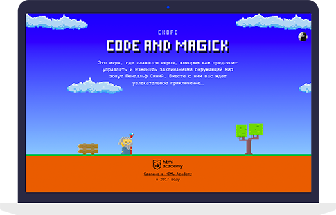

# Личный проект «Код и магия»

[![Build status][travis-image]][travis-url]
[![Dependency status][dependency-image]][dependency-url]

Это игра, где главного героя, которым вам предстоит управлять и изменять заклинаниями окружающий мир зовут Пендальф
Синий. Вместе с ним вас ждет увлекательное приключение…

* Студент: Алексей Истомин.

_Не удаляйте и не обращайте внимание на файлы:_ 
_`.editorconfig`, `.eslintignore`, `.eslintrc`, `.gitignore`, `.travis.yml`, `Makefile`, `package.json`._

---

Репозиторий создан для обучения на интенсивном онлайн-курсе «[Базовый JavaScript](https://htmlacademy.ru/js_intensive)» от [HTML Academy](https://htmlacademy.ru).

[travis-image]: https://travis-ci.org/webistomin/code-and-magick.svg?branch=master
[travis-url]: https://travis-ci.org/webistomin/code-and-magick
[dependency-image]: https://david-dm.org/webistomin/code-and-magick.svg?style=flat-square
[dependency-url]: https://david-dm.org/webistomin/code-and-magick

